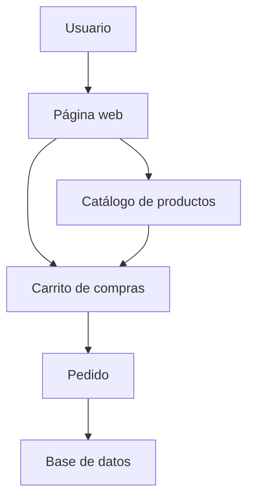

# Tienda Virtual Melie
Tienda virtual dedicada a la venta de productos y postres artesanales.
El proyecto permite visualizar los productos disponibles, consultar sus precios y gestionar una compra de manera sencilla.
## Tabla de contenidos
- Descripcion
- Instalacion
- Uso
- Funciomalidades
- Tareas pendientes
- Arquitectura
- Contibuidores
### Descripcion
Tienda Virtual Melie es un proyecto académico pensado para ofrecer productos artesanales mediante una plataforma sencilla y fácil de utilizar.

Los usuarios pueden revisar los productos, consultar sus precios, agregarlos al carrito y realizar un pedido.
### Instalacion
git clone https://github.com/emelycoaguila/laboratorio-readme.git cd laboratorio-readme npm install
### USO
Después de iniciar el proyecto, abre el navegador y accede a la dirección indicada por la aplicación.
## Estado de funcionalidades 
  
| Función  | Estado      | 
|----------|-------------| 
| Mostrar productos | Completado  | 
| Mostrar precios   | Completado  | 
| Agregar productos | Completado  | 
| Realizar pedidos  | Completado  | 
| Registrodeusuarios| Pendiente   | 
## Tareas pendientes

-	[x] Agregar registro e inicio de sesion.
-	[ ] Implementar un sistema de pagos.
-   [ ] Agregar historial de pedidos.
-   [ ] Mejorar el diseño de la tienda.
-   [ ] Agregar filtros para buscar productos.
## Arquitectura
## Arquitectura

## Contribuidores
|  Nombre  | GitHub      | 
|----------|-------------| 
| Emely Coaguila   | @emelycoaguila     | 
